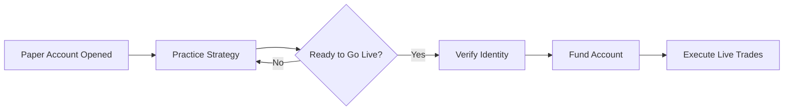

# Paper vs Real-Money Investing

**Lessons & Limitations**

| Aspect                 | Paper Trading                                                                       | Real-Money Trading                               |
|------------------------|-------------------------------------------------------------------------------------|--------------------------------------------------|
| Emotional Stress       | Low – no real capital at risk                                                      | High – real gains & losses                       |
| Market Dynamics        | Simulated fills, may ignore slippage & liquidity                                     | Live bid-ask spreads, order execution realities  |
| Strategy Validation    | Fast iteration, easy reset                                                          | High confidence but slower iteration             |
| Cost & Fees            | Often zero fees                                                                     | Commissions, exchange fees, margin interest      |
| Behavioral Fidelity    | Limited – no psychological pressure                                                 | True – risk management & emotional control tested|

## Platforms & Tools

### Supported Platforms
- **Moolah Capital Demo**: Virtual cash, live data, basic analytics.  
- **TradingView Paper**: Advanced charting, community scripts, alerts.

### Transition Flow

## Best Practices Checklist
1. **Emergency Fund** in place (3–6 months of expenses).  
2. **Backtested Strategy** documented.  
3. **Realistic Virtual Capital** mirroring intended live allocation.  
4. **Risk Rules** defined (stop‑loss, position sizing).  
5. **Emotion Control Plan** (journaling, cool-down periods).

## Visual Guide

## Next Steps
- Review your simulated performance and identify gaps.  
- Gradually scale position sizes when moving live.  
- Keep a trading journal to track psychological responses.

